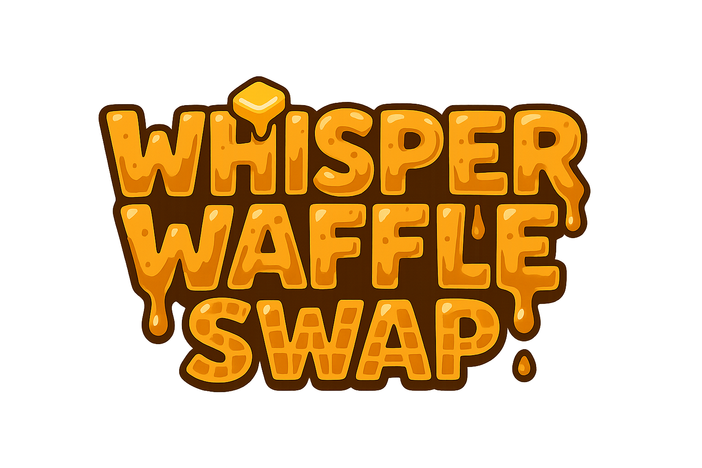

# 🧇 WhisperWaffle - The Sweetest DEX on Aleo

**WhisperWaffle** is a **Minimum Viable Product (MVP)** built for the **Aleo Code Sprint 4.0**, demonstrating core DeFi functionality on the Aleo blockchain. This MVP showcases the potential of building decentralized exchanges on Aleo while maintaining simplicity for the sprint deadline.

## 🚀 **MVP for Aleo Code Sprint 4.0**

### **What's Included (MVP)**
- **Fixed Rate Trading**: 4:1 exchange rate (4 wALEO = 1 wUSDC)
- **Liquidity Pools**: Basic pool creation and management
- **Wrapped Tokens**: ALEO ↔ wALEO conversion
- **Public Transactions**: No privacy features for sprint demo

### **Future Features (Post-Sprint)**
- **Privacy**: Zero-knowledge proof integration
- **AMM**: Replace fixed rate with market-driven pricing
- **Advanced Features**: Cross-chain bridge, governance, mobile app

## 🏗️ **Architecture**

### **Smart Contracts**
- **Main DEX**: `ww_swap_v13.aleo` - Fixed rate swaps and pool management
- **Wrapped Credits**: `ww_swap_wrapped_credits_v1.aleo` - ALEO ↔ wALEO conversion
- **Language**: Leo 3.1.0
- **Network**: Aleo Testnet Beta

### **Key Functions**
- **Swaps**: `swap_waleo_for_token()`, `swap_token_for_waleo()` (4:1 fixed rate)
- **Pools**: `create_pool_public()`, `add_liquidity_public()`, `remove_liquidity_public()`
- **Wrapping**: `deposit_credits_public_signer()`, `withdraw_credits_public_signer()`

## 🎯 **Key Features**

### **Tokens**
- **wALEO**: Wrapped ALEO token for DeFi operations
- **wUSDC**: Custom token for trading
- **Fixed Rate**: 4:1 exchange rate (4 wALEO = 1 wUSDC)

### **Trading**
- **Fixed Rate Swaps**: Direct conversion at 4:1 rate
- **Liquidity Pools**: Basic pool management
- **Fee**: 0.3% swap fee

## 🤝 **Contributing**

We welcome contributions! Please see our contributing guidelines for code standards, testing, and pull request process.

## 🚀 **Roadmap**

### **Current: Aleo Code Sprint 4.0**
- **Goal**: Demonstrate DeFi on Aleo blockchain
- **Status**: MVP with fixed rate trading

### **Future**
- **Phase 1**: Privacy features and zero-knowledge proofs
- **Phase 2**: AMM implementation and dynamic pricing
- **Phase 3**: Cross-chain bridge and governance

## 📄 **License**

MIT License - see LICENSE file for details.

## 🙏 **Acknowledgments**

- **Arcanne Finance**: For architectural inspiration
- **Aleo Team**: For Leo language and blockchain
- **Community**: For feedback and testing

---

**WhisperWaffle MVP** - Demonstrating DeFi on Aleo for Code Sprint 4.0! 🚀🧇

*This MVP showcases core DeFi functionality with public token trading. Future versions will include full privacy features and advanced DeFi mechanics.*
